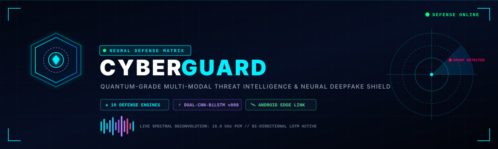
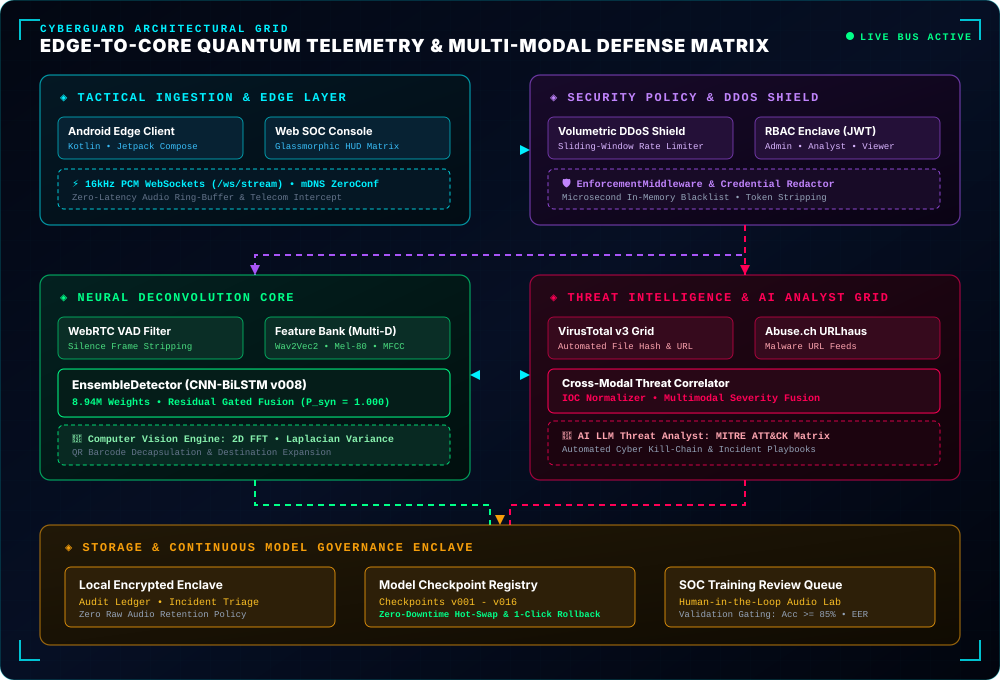
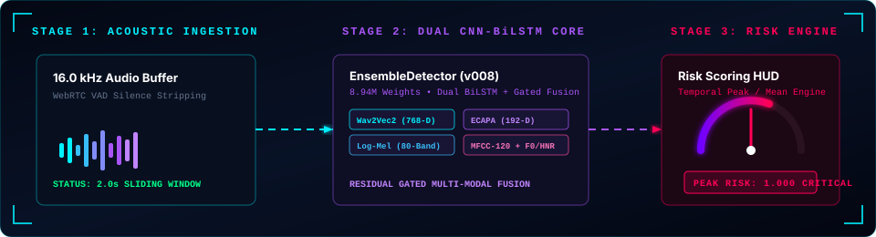
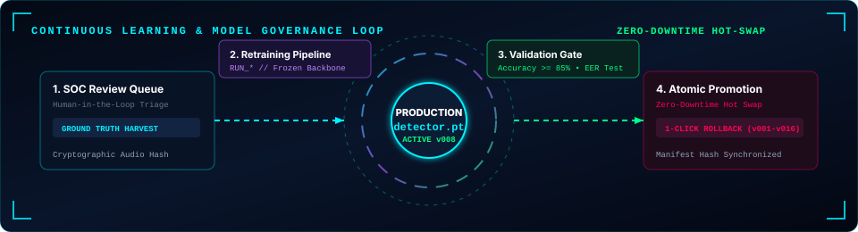

<p align="center">
  
</p>

<p align="center">
  <strong>CYBERGUARD</strong><br>
  <em>Enterprise AI-Powered Cyber Threat, Voice Deepfake &amp; Multi-Modal Intelligence Platform</em><br>
  <small>Autonomous Signal Deconvolution • Real-Time Acoustic Forensics • Edge-to-Core Telemetry Grid</small>
</p>

<p align="center">
  <a href="#-system-telemetry--status"></a>
  <a href="#-neural-detector--model-governance"></a>
  <a href="#-android-edge-companion-client"></a>
  <a href="#-multi-engine-threat-intelligence"></a>
  <a href="#-enterprise-technology-stack"></a>
</p>

---

<table width="100%">
  <tr>
    <td width="20%" align="center">
      <br><br>
      <br>
      
    </td>
    <td>
      <strong>⚡ ADVANCED THREAT ENVIRONMENT // TACTICAL DIRECTIVE</strong><br><br>
      Biometric voice theft, neural audio cloning (RVC/TTS), adversarial QR quishing, and automated social engineering attacks have rendered legacy perimeter defenses obsolete.<br><br>
      <strong>CYBERGUARD</strong> deploys multi-layered neural signal deconvolution, real-time edge streaming, and autonomous threat intelligence correlation to nullify synthetic vectors at the nanosecond edge.
    </td>
  </tr>
</table>

---

## ◈ SYSTEM TELEMETRY & STATUS

| ⬡ Telemetry Sensor / Subsystem | Current Metric / Checkpoint | Operational State | Protocol / Target Specification |
| :--- | :--- | :---: | :--- |
| 🛡️ **Defense Matrix Status** | `10 / 10 Engines Online` |  | Real-time autonomous synthetic interception grid |
| 🧠 **Active Neural Checkpoint** | `detector.pt` • **8,941,976 Parameters** |  | CNN-BiLSTM + Gated Multi-Modal Fusion (35.8 MB) |
| 🎙️ **Acoustic Ingestion Stream** | `16,000 Hz Mono PCM` |  | 2.0s temporal receptive window • 50% frame overlap |
| 🛰️ **Edge Discovery Beacon** | `_cyberguard._tcp.local.` |  | Subnet multicast DNS automatic handshake |
| 🌐 **External Threat Feeds** | `VirusTotal v3` + `URLhaus Malware` |  | Real-time cryptographic hash correlation & IOC sync |
| 🔒 **Zero-Trust Privacy Directive**| `Zero Raw Audio Storage` |  | Volatile buffer purge • Zero persistence on physical disk |

---

## ◈ FEATURE DEFENSE MATRIX

| ⬡ Tactical Defense Vector | Defense Tier | Status | Neural & Intelligence Mechanism |
| :--- | :---: | :---: | :--- |
| 🎙️ **Neural Voice Clone Interceptor** | `Tier 1 (Core AI)` |  | **8.94M** parameter dual-modality CNN-BiLSTM + Gated Multi-Modal Fusion network with Wav2Vec2-768 & ECAPA-192 embeddings. |
| ⚡ **Real-Time Acoustic Stream HUD** | `Tier 1 (Edge Stream)` |  | Sub-second streaming microphone ingestion with WebRTC VAD silence stripping over high-throughput binary WebSockets. |
| 🛰️ **Android Edge Companion** | `Tier 2 (Edge Node)` |  | Dedicated Kotlin/Jetpack Compose edge client with background Telecom call interception and ZeroConf discovery. |
| 🌐 **Multi-Engine Threat Intelligence** | `Tier 2 (Global Intel)` |  | Autonomous cryptographic hash (SHA-256/MD5) correlation via VirusTotal v3 and active malware feed querying via URLhaus. |
| 🔍 **Phishing & URL De-anonymizer** | `Tier 3 (Perimeter)` |  | Multi-factor heuristics: Shannon entropy, punycode IDN spoofing, typosquatting vectors, and recursive redirect unshortening. |
| 📱 **QR Code Forensics ("Quishing")** | `Tier 3 (Computer Vision)` |  | Computer vision matrix barcode decapsulation with automated payload safety extraction and destination verification. |
| 🧬 **Cross-Modal Deepfake Coordinator** | `Tier 3 (Multi-Modal)` |  | Multi-modal forensics: 2D Fast Fourier Transform (FFT) spectral roll-off, Laplacian variance, and automated video audio demuxing. |
| 👤 **Biometric Voice Identity Enclave** | `Tier 1 (Zero-Trust)` |  | 192-dimensional ECAPA-TDNN biometric reference embeddings with dynamic cosine divergence penalties. |
| 🤖 **Explainable AI LLM Threat Analyst** | `Tier 4 (Cognitive)` |  | MITRE ATT&CK enterprise technique mapping, automated cyber kill-chain reconstruction, and incident response playbooks. |
| 🚨 **Autonomous SOC Incident Core** | `Tier 4 (Governance)` |  | Complete incident lifecycle (`OPEN` ➔ `INVESTIGATING` ➔ `CONTAINED` ➔ `RESOLVED`), analyst notes, and executive report exports. |
| 🔄 **Continuous Learning Engine** | `Autonomous Engine` |  | Verified human-in-the-loop review queue, background retraining jobs, validation gating (F1, EER), and 1-click rollback. |
| 🛡️ **Security Shield & DDoS Barrier** | `Tier 0 (Infra Shield)`|  | Microsecond-latency enforcement middleware with sliding-window rate limiting, brute-force shielding, and log redaction. |

---

## ◈ ARCHITECTURE: EDGE-TO-CORE DATA GRID

<p align="center">
  
</p>

<details>
<summary><strong>▶ CLICK TO EXPAND ARCHITECTURAL TOPOLOGY &amp; LAYER INTERCONNECT MATRIX</strong></summary>

<br>

| Architectural Zone | Primary Operational Nodes | Transport Protocol | Security & Isolation Directives |
| :--- | :--- | :--- | :--- |
| 🛰️ **Zone 1: Tactical Ingestion & Edge** | Android Edge Client • CyberGuard SOC Web HUD | Binary PCM WebSockets (16kHz) | Local mDNS ZeroConf Auto-Discovery |
| 🛡️ **Zone 2: Security Policy & DDoS Shield** | Volumetric Rate Limiter • RBAC Enclave • Auto-Redactor | ASGI Interceptor Middleware | JWT Bearer • In-Memory PII Stripping |
| 🧠 **Zone 3: Neural Deconvolution Core** | WebRTC VAD • Feature Bank (120-D MFCC, 80-Mel) • CNN-BiLSTM v008 | Zero-Copy Memory Bus | Ephemeral RAM Enclave • Zero Raw Voice Storage |
| 🌐 **Zone 4: Autonomous Threat Grid** | VirusTotal v3 • Abuse.ch URLhaus • AI LLM Analyst | REST v3 • Streaming JSON Feeds | MITRE ATT&CK Mapping • Automated Playbooks |
| 🗄️ **Zone 5: Storage & Governance Enclave** | Encrypted SQLite Enclave • Model Registry (`v001`-`v016`) | Atomic Promotion Pipeline | SOC Review Queue Gate • Instant 1-Click Rollback |

</details>

---

## ◈ REAL-TIME NEURAL SIGNAL DECONVOLUTION

<p align="center">
  
</p>

### 1. Ingestion &amp; Silence Filtering
Audio is captured at 16,000 Hz 16-bit mono PCM. An integrated **WebRTC Voice Activity Detector (VAD)** strips non-vocal frames in real time, delivering clean acoustic segments in 2.0-second temporal windows with 50% overlap.

### 2. Multi-Modal Representation Extraction
- **Log-Mel Spectrograms**: 80-band time-frequency distribution capturing harmonic micro-structures.
- **MFCC Dynamics**: 40 coefficients with first and second temporal derivatives ($\Delta + \Delta\Delta = 120\text{-D}$).
- **Prosodic Biomarkers**: Fundamental frequency ($F_0$), micro-tremor Jitter, Shimmer, and Harmonics-to-Noise Ratio (HNR).
- **Self-Supervised Representations**: 768-dimensional contextual features via `facebook/wav2vec2-base`.
- **Deep Biometric Embeddings**: 192-dimensional speaker identity vectors via `speechbrain/spkrec-ecapa-voxceleb`.

### 3. Gated Neural Fusion &amp; Risk Scoring
Extracted features pass through a dual-stream Convolutional Bi-directional LSTM with residual gated fusion. A sliding temporal smoothing window evaluates peak risk and mean risk, applying divergence penalties against enrolled speaker profiles.

---

## ◈ ANDROID EDGE COMPANION CLIENT

CyberGuard includes a native Android edge client engineered with **Kotlin**, **Jetpack Compose**, and **Kotlin Coroutines**. It transforms mobile handsets into tactical telemetry nodes.

```
android/app/src/main/java/com/cyberguard/client/
├── audio/
│   └── RealTimeAudioPipeline.kt    # 16kHz PCM capture and low-latency WebSocket streaming
├── service/
│   └── CallMonitorService.kt       # Persistent Android Telecom foreground monitor
├── network/
│   ├── ConnectionManager.kt        # mDNS ZeroConf scanning & auto-handshake
│   ├── WebSocketClient.kt          # Bi-directional risk telemetry socket
│   └── CyberGuardApi.kt            # REST forensics and speaker enrollment interface
└── ui/screens/
    ├── DashboardScreen.kt          # Real-time connection HUD & system health
    ├── LiveMonitorScreen.kt        # Live microphone capture & risk scoring gauge
    ├── CallMonitorScreen.kt        # In-call ambient telecom acoustic monitoring
    ├── FileAnalysisScreen.kt       # Offline audio file upload & forensic breakdown
    ├── SpeakerManagementScreen.kt  # Biometric voice profile enrollment & management
    └── AlertHistoryScreen.kt       # High-risk security event notification stream
```

### Edge Companion Highlights
- **ZeroConf Network Auto-Discovery**: Discovers the local backend server via mDNS records (`_cyberguard._tcp.local.`) on the Wi-Fi subnet without manual IP entry.
- **High-Throughput Audio Pipeline**: Captures 16,000 Hz 16-bit mono PCM audio in chunked buffers and transmits binary frames over WebSockets with minimal latency.
- **Call Monitor (Mixed Acoustic Fallback)**: Integrates with Android Telecom to detect `RINGING` and `ACTIVE` states. Employs acoustic earpiece/speakerphone fallback to detect cloned voices during live calls while honoring Android OS sandbox constraints.
- **Biometric Edge Enrollment**: Enrolls trusted speaker profiles directly from the phone microphone, transferring embeddings to the PC enclave for continuous consistency verification.

---

## ◈ NEURAL DETECTOR &amp; MODEL GOVERNANCE

The acoustic detection engine is powered by an active neural network checkpoint (`detector.pt`, version `v008`):

### 1. Model Specifications

| Specification Metric | Production Parameter Target | Architecture & Verification Confidence |
| :--- | :--- | :--- |
| 🧠 **Model Architecture** | `EnsembleDetector (v008)` | Dual-Stream Convolutional Bi-directional LSTM with Gated Fusion |
| ⚖️ **Total Weight Parameters** | **8,941,976 parameters** (~35.8 MB) | Quantization-ready native PyTorch checkpoint (`detector.pt`) |
| 🎙️ **Acoustic Ingestion Rate** | `16,000 Hz Mono PCM` | 2.0s temporal receptive field with 50% sliding window overlap |
| 🎯 **Benchmark Accuracy** | **90.0% Validation Accuracy** • **0.95 Precision** | Evaluated on ASVspoof • Genuine $p \le 0.095$, Clone $p \approx 1.000$ |

### 2. Autonomous Model Lifecycle Management Loop

<p align="center">
  
</p>

- **SOC Training Review Queue**: Disputed recordings are staged in the review queue for analyst ground-truth labeling (`HUMAN` vs. `CLONED`).
- **Background Retraining Engine**: Dispatches asynchronous retraining jobs (`RUN_*`) using verified samples with balanced sampling.
- **Validation Gates**: Candidates must clear strict validation criteria ($\ge 85\%$ accuracy, reduced EER) before being eligible for promotion.
- **Atomic Hot-Swap Promotion &amp; 1-Click Rollback**: Checkpoints are swapped atomically with zero service downtime. Administrators can roll back to any historical model checkpoint (`v001` through `v016+`) instantly.
- **Representation-Preserving Fine-Tuning**: Online detector updates lock all convolutional and BiLSTM representation layers, adapting only final classification heads with bounded learning rates ($\le 5 \times 10^{-5}$) to prevent catastrophic forgetting.

---

## ◈ MULTI-ENGINE THREAT INTELLIGENCE &amp; QUISHING DEFENSE

<p align="center">
  
</p>

### 1. VirusTotal v3 Autonomous Pipeline
- Automatically hashes all uploaded media assets (SHA-256, MD5, SHA-1).
- Queries VirusTotal's global intelligence database across 70+ security vendors.
- Cross-references URLs, IP addresses, and domain reputations during incident triage.

### 2. Abuse.ch URLhaus Feed Integration
- Queries active feeds of weaponized malware distribution URLs and malicious landing pages.
- Correlates discovered IOCs against known advanced persistent threat (APT) campaigns.

### 3. QR Code Forensics ("Quishing" Neutralizer)
- Automatically decodes matrix barcodes from image uploads using computer vision algorithms.
- Recursively expands and de-obfuscates destination URLs through safe headless redirect traversal.
- Evaluates destination hostnames for punycode homograph attacks, Shannon entropy spikes, and known phishing indicators.

### 4. Explainable AI LLM Threat Analyst
- Synthesizes complex multi-source telemetry into plain-language SOC executive briefing reports.
- Automatically maps discovered threat indicators directly to the **MITRE ATT&amp;CK Enterprise Matrix**:
  - `T1566.002` — *Spearphishing Link*
  - `T1566.003` — *Spearphishing via Service (Cloned Voice / Deepfake)*
  - `T1656` — *Impersonation &amp; Social Engineering*
  - `T1204.001` — *User Execution: Malicious URL*
  - `T1110.001` — *Password Guessing / Brute Force Attack*
- Formulates automated Incident Response Playbooks detailing targeted **Containment**, **Eradication**, and **Recovery** measures.

---

## ◈ ENTERPRISE TECHNOLOGY STACK

| ⬡ Architectural Domain | Primary Stack / Engine | Core Capabilities & Specifications |
| :--- | :--- | :--- |
| ⚡ **Core Backend & Async** | `Python 3.12` • `FastAPI (ASGI)` • `Uvicorn` | Asynchronous REST & WebSocket orchestrator, Pydantic v2 schema validation, non-blocking I/O |
| 🧠 **Neural & Acoustic AI** | `PyTorch 2.x` • `TorchAudio` • `Hugging Face` | Dual-stream CNN-BiLSTM, Wav2Vec 2.0 context encoders, 8.94M parameter weights |
| 🎙️ **Acoustic DSP Core** | `SpeechBrain` • `Librosa` • `WebRTC VAD` | 192-D ECAPA-TDNN embeddings, 80-band Mel filterbanks, real-time silence stripping |
| 🔬 **Computer Vision** | `OpenCV` • `Pillow` • `PyZbar` • `NumPy` | Laplacian edge variance, 2D Fast Fourier Transform (FFT) roll-off, matrix barcode decapsulation |
| 🌐 **Threat Intelligence** | `VirusTotal v3` • `Abuse.ch URLhaus` | Autonomous cryptographic hash lookups, active malware domain feeds, MITRE ATT&CK mapping |
| 🛰️ **Mobile Edge Client** | `Kotlin` • `Jetpack Compose` • `Material 3` | Native Android mobile node, reactive StateFlow architecture, OkHttp WebSocket duplex |
| 📞 **Mobile Telephony** | `Android Telecom` • `AudioRecord 16kHz` | Persistent foreground call interception, dual-stream mixed acoustic capture fallback |
| ⚡ **Protocols & Discovery** | `WebSockets` • `mDNS ZeroConf` • `HTTP/2` | Sub-millisecond binary PCM audio streaming, zero-configuration local subnet discovery |
| 🛡️ **Security Policy & Shield** | `Python-Jose (JWT)` • `Passlib (Bcrypt)` | Sliding-window DDoS mitigation, brute-force defense, RBAC enclave, log parameter sanitization |
| 🗄️ **Storage & Governance** | `SQLite 3 Enclave` • `SQLAlchemy ORM` | Local encrypted threat ledger, incident metadata repository, model version checkpoints |
| 💻 **Web SOC Command HUD** | `Modern CSS3 (Glassmorphic)` • `Chart.js 4.4`| Futuristic cybernetic console, dynamic telemetry charts, audio spectrogram canvas |

---

## ◈ WEB SOC CONSOLE (8 COMMAND PANELS)

The web command center hosted at `http://127.0.0.1:3000` provides an eye-catching glassmorphic SOC interface with 8 purpose-built panels:

| ⬡ Panel | Command Interface | Tactical Responsibility & Telemetry Outputs | Operational State |
| :---: | :--- | :--- | :---: |
| `01` | 📊 **Overview Command** | Executive posture banner, 5 Core KPI tiles, dynamic threat activity charts, engine matrix |  |
| `02` | 🎙️ **Live Audio Monitor** | Real-time streaming audio waveform oscilloscope, sub-second risk gauge, live event log |  |
| `03` | 🔬 **Voice Forensics Lab**| Deepfake forensic audio file upload, WebRTC VAD chunking, VirusTotal v3 hash card |  |
| `04` | 🌐 **Phishing & Quishing**| URL inspection, Shannon entropy analysis, QR quishing payload extractor & unshortener |  |
| `05` | 👤 **Identity Enclave** | 192-D ECAPA-TDNN reference voice enrollment, biometric consistency analyzer |  |
| `06` | 🚨 **Security Incident Core**| SOC incident manager, triage workflow, AI analyst threat narratives, executive PDF export |  |
| `07` | 🔄 **Continuous Review Lab**| Human-in-the-loop continuous learning queue, ground-truth labeling, retraining dispatch |  |
| `08` | ⚙️ **Admin & Governance** | Model checkpoint versions (`v001` - `v016`), atomic promotion, 1-click rollback HUD |  |

---

## ◈ TACTICAL API & WEBSOCKET SPECIFICATION

<details>
<summary><strong>▶ CLICK TO EXPAND FULL REST &amp; WEBSOCKET ROUTE MATRIX</strong></summary>

<br>

### 🔑 Identity & Access Enclave
| Method | Endpoint Route | Authorization Level | Tactical Purpose |
| :---: | :--- | :---: | :--- |
|  | `/api/auth/login` |  | Authenticates credentials and issues JWT bearer token |
|  | `/api/auth/register` |  | Registers new operational user account |
|  | `/api/auth/me` |  | Retrieves current user role (`ADMIN`, `ANALYST`, `VIEWER`) |
|  | `/api/auth/logout` |  | Invalidates active user session and bearer claims |

### 🧠 Model Governance & Continuous Learning
| Method | Endpoint Route | Authorization Level | Tactical Purpose |
| :---: | :--- | :---: | :--- |
|  | `/api/admin/models` |  | Lists all model checkpoints (`v001` - `v016`), file sizes, and verification metrics |
|  | `/api/admin/models/promote` |  | Atomically promotes candidate model checkpoint to active production `detector.pt` |
|  | `/api/admin/models/rollback`|  | Instantly rolls back active neural detector to specified historical checkpoint version |
|  | `/api/admin/training/trigger`|  | Dispatches background model retraining job with verified review queue dataset |
|  | `/api/admin/reviews` |  | Fetches disputed acoustic samples staged in human-in-the-loop review queue |
|  | `/api/admin/reviews/{id}/decision` |  | Commits verified ground-truth classification (`HUMAN` vs. `CLONED`) to dataset |

### 🔬 Forensics, Phishing & Multi-Modal Threat Intelligence
| Method | Endpoint Route | Authorization Level | Tactical Purpose |
| :---: | :--- | :---: | :--- |
|  | `/api/analyze` |  | Uploads audio file for VAD chunking, neural inference, and VirusTotal v3 hash lookup |
|  | `/api/threats/unified` |  | Unified cross-modal threat evaluation across audio, URL, QR, and contextual text |
|  | `/api/threats/url` |  | Evaluates destination URL for entropy anomalies, punycode spoofing, and feeds |
|  | `/api/threats/qr` |  | Computer vision matrix barcode decapsulation and extracted payload analysis |
|  | `/api/threats/llm-analysis` |  | Generates AI SOC threat narrative, MITRE ATT&CK mapping, and remediation playbook |
|  | `/api/threats/pipeline/status` |  | Live telemetry status of VirusTotal, URLhaus, and neural detection pipelines |

### 🚨 Incident Response & Speaker Biometrics
| Method | Endpoint Route | Authorization Level | Tactical Purpose |
| :---: | :--- | :---: | :--- |
|  | `/api/incidents/` |  | Lists all tracked security incidents and active investigative states |
|  | `/api/incidents/dashboard/summary` |  | Fetches aggregate SOC metrics, active incident counts, and threat level |
|  | `/api/incidents/{id}/status` |  | Transitions incident state (`OPEN` ➔ `INVESTIGATING` ➔ `CONTAINED` ➔ `RESOLVED`) |
|  | `/api/speakers/enroll` |  | Enrolls reference vocal sample into 192-dim ECAPA-TDNN biometric enclave |
|  | `/api/speakers` |  | Lists all enrolled biometric speaker identities and verification thresholds |

### Real-Time WebSocket Protocol (`/ws/stream`)
- **Client (Android / Edge) Transmits**:
  - `Binary Frames`: 16kHz 16-bit Mono PCM raw byte stream
  - `Control JSON`: `{"type": "start_call_monitor", "capture_mode": "MIXED_ACOUSTIC"}`
- **Server (CyberGuard Core) Emits**:
  - `Session Handshake`: `{"type": "session_start", "session_id": "...", "detector_ready": true, "version": "v008"}`
  - `Voice Activity Status`: `{"type": "status_update", "status": "WAITING_FOR_DATA"}`
  - `Instant Risk Assessment`: `{"type": "risk_update", "risk_score": 0.999, "alert_level": "CRITICAL", "is_synthetic": true}`

</details>

---

## ◈ DEPLOYMENT &amp; QUICK START

### 1. Host Requirements

| Host Component | Minimum Requirement | Recommended Specification |
| :--- | :--- | :--- |
| 🐍 **Python Environment** | `Python 3.10`+ | `Python 3.12.10` (x86_64 / ARM64) |
| 🔊 **Audio Demuxing Engine** | `FFmpeg 4.4`+ | `FFmpeg 6.0`+ configured in system `PATH` |
| ⚡ **Compute Infrastructure**| `4-Core CPU` • `8 GB RAM` | `8-Core CPU` • `NVIDIA CUDA GPU` (16 GB VRAM) |

### 2. Environment Initialization
```powershell
# 1. Clone the repository
git clone https://github.com/Arthur-2407/CyberGuard.git
cd CyberGuard

# 2. Initialize isolated virtual environment
python -m venv venv

# 3. Activate environment (Windows PowerShell)
.\venv\Scripts\Activate.ps1
# (On Linux / macOS: source venv/bin/activate)

# 4. Install production dependencies
pip install -r backend\requirements.txt
```

### 3. Launching the CyberGuard Defense Node
```powershell
# Run the FastAPI server via Uvicorn on port 3000
.\venv\Scripts\python.exe -m uvicorn backend.main:app --host 0.0.0.0 --port 3000 --reload
```
*Or execute the automated launcher script:*
```powershell
.\start_server.ps1
```

### 4. Tactical Access Points

| Command Center Node | Operational Access URL | Functional Scope | Status |
| :--- | :--- | :--- | :---: |
| 💻 **Web SOC Command HUD** | [`http://127.0.0.1:3000`](http://127.0.0.1:3000) | Primary cybernetic dashboard, audio oscilloscope, & real-time risk gauges |  |
| 📑 **Interactive OpenAPI (Swagger)** | [`http://127.0.0.1:3000/docs`](http://127.0.0.1:3000/docs) | Full interactive schema explorer & REST endpoint execution suite |  |
| 📖 **Alternative ReDoc Console** | [`http://127.0.0.1:3000/redoc`](http://127.0.0.1:3000/redoc) | Clean offline-capable technical API specification viewer |  |

---

## ◈ VERIFICATION &amp; TEST SUITE

CyberGuard maintains an automated regression and lifecycle test harness:

```powershell
# Execute detector adaptation and Security Center integration tests
.\venv\Scripts\python.exe -m pytest tests/test_manual_detector_adaptation.py tests/test_security_center.py

# Execute continuous learning lifecycle verification (retraining, validation, promotion, and rollback)
.\venv\Scripts\python.exe scripts/test_continuous_learning_lifecycle.py
```

---

## ◈ ZERO-TRUST PRIVACY DIRECTIVE

CyberGuard enforces strict privacy and data isolation standards:
- **Zero Raw Voice Storage**: Audio buffers held in volatile RAM are securely overwritten and dropped immediately upon feature extraction. **Audio recordings are never written to permanent disk storage.**
- **Local Enclave Inference**: Biometric speaker profiles, acoustic feature matrices, and neural classifications are processed entirely on local hardware. No voice data is transmitted across third-party cloud APIs.
- **Sensitive Parameter Redaction**: Built-in regex filters redact API tokens, passwords, authorization headers, and confidential query parameters across all server logs.
- **Auditable Security Ledger**: Every administrative configuration change, model rollback, and SOC decision is cryptographically timestamped in the administrative audit ledger.

---

<p align="center">
  <strong>CYBERGUARD</strong><br>
  <em>Engineered for Maximum Resilience • Verified at the Neural Edge</em>
</p>
